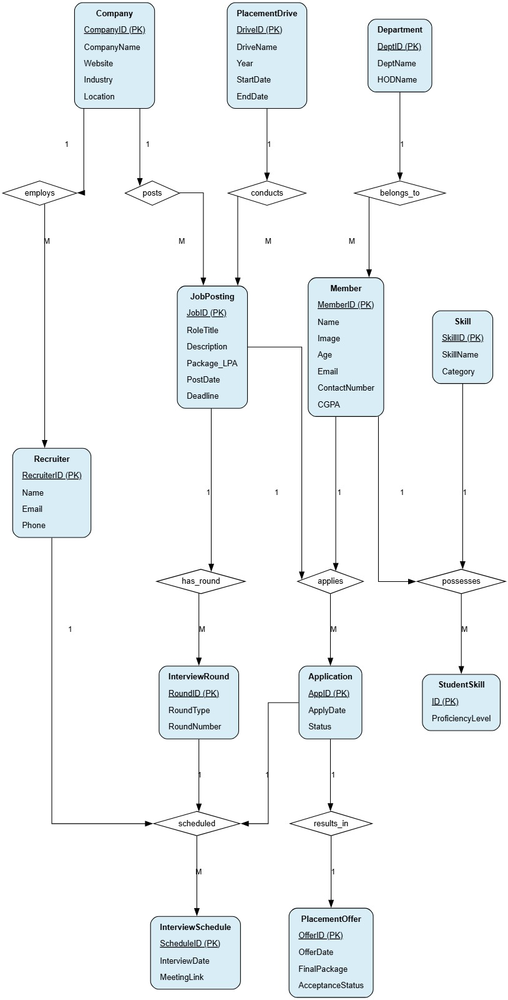

# 🎓 CareerTrack - Placement Management System 

A robust, database-driven software solution designed to automate and manage the college placement process efficiently. Developed as part of the Database Management Systems course at IIT Gandhinagar.

## 📌 Project Overview
Many institutions handle placement activities manually, leading to data duplication, delayed communication, and inconsistent records. CareerTrack provides a centralized, automated platform to manage student details, track company job postings, and seamlessly process job applications from end to end.

---

## 🌟 Assignment 3: Transaction Management & Recovery
*Current Submission*

Building upon our storage engine and web application from previous assignments, this phase focuses on ensuring data integrity, concurrent access control, and crash recovery. We upgraded our custom database engine to be fully ACID-compliant.

### 🌐 Module B: Reliability & Stress Testing
To ensure our web application and database components can handle real-world scenarios:
* **Module B Tests:** We created a comprehensive test suite in the `Module_B_Test` directory to validate the functionality and reliability of the web application endpoints.
* **Concurrency Stress Testing:** Implemented `acid_stress_test.py` to simulate high-concurrency workloads, guaranteeing that our transactional isolation and locking mechanisms hold up under pressure without data corruption.

### ⚙️ Module A: ACID-Compliant B+ Tree Storage Engine
We overhauled our custom B+ Tree database engine to guarantee ACID properties:
* **Atomicity:** Built an undo buffer mechanism for `BEGIN`, `COMMIT`, and `ROLLBACK` commands spanning multiple independent B+ Trees simultaneously.
* **Consistency:** Engineered a robust constraint validation engine enforcing Primary Key uniqueness, Foreign Key integrity, and domain constraints prior to data insertion.
* **Isolation:** Integrated per-transaction global locking (`threading.Lock`) that provides Strict Serializable isolation, preventing dirty reads and lost updates.
* **Durability:** Implemented Write-Ahead Logging (WAL) with `fsync` guarantees. Designed a pure-redo crash recovery protocol to rebuild memory states exclusively from committed transactions in `bptree_wal.log`.
* **ACID Test Suite:** Created `acid_test_suite_Module_A.py` with 20 targeted tests to aggressively validate our Atomicity, Consistency, Isolation, and Durability implementations.

For a deeper dive into Module A's implementation, see the detailed [Module A README](./Module_A/database/README.md).

---

## 🚀 Assignment 2: Web Application & Storage Engine
*Previous Submission*

Building upon our relational database design from Assignment 1, this phase transitions the project from a conceptual schema into a fully functional, secure web application, while also exploring the low-level mechanics of database storage.

### ⚙️ Module A: Custom Storage Engine (B+ Tree)
To understand how databases optimize data retrieval under the hood, we built a custom indexing structure:
* **B+ Tree Implementation:** Developed a pure Python simulation of a B+ Tree storage engine.
* **Performance Benchmarking:** Proved **$O(\log N)$** time complexity for search, insert, and delete operations.
* **Complexity Analysis:** Generated standardized graphical reports comparing our B+ Tree against linear data structures to demonstrate enterprise-level scalability.

### 🌐 Module B: Secure Web API & Application
We brought the CareerTrack system to life using a modern backend architecture:
* **Framework:** Built a RESTful Web API and user interface using **Flask (Python)**.
* **Relational Persistence:** Migrated our initial schema to **SQLite**, modularizing the initialization into core tables, project data dumps, and performance indexes.
* **Role-Based Access Control (RBAC):** Implemented secure session handling, restricting specific endpoints based on user roles (Admin, Placement Officer, Student).
* **Audit Logging:** Engineered a dedicated `audit.py` interceptor that strictly logs all system access attempts and data modifications (recording timestamp, user ID, and action) to ensure maximum security accountability.

The reports and the explaination video are present in the report folder and all the details are mentioned there.

### 👨‍💻 Assignment 2 Contributions
* **Pramith Joy (23110152):** Core B+ Tree storage engine implementation, algorithmic complexity analysis, and benchmarking reports (Module A).
* **Bhavitha Somireddy (24110350):** Flask web application architecture, REST API endpoint development, and modular routing (Module B).
* **Killada Eswara Valli (24110165):** Frontend UI integration, dynamic HTML template rendering for user dashboards, and session state management.
* **Garv Singhal (24110119):** Security framework design, including Role-Based Access Control (RBAC) and the `audit.py` logging mechanism.
* **Divyansh Saini (23110101):** SQLite database migration, schema modularization (`core_tables.sql`, `indexes.sql`), and query optimization.

---

## 📁 Assignment 1: Database Design & Architecture
*Previous Submission*

### 🎯 Core Objectives
* Create a centralized relational database for placement management.
* Automate the job application and selection tracking process.
* Ensure data consistency and reduce manual record-keeping errors.
* Manage detailed profiles for students, recruiting companies, and job roles.

### 🏗️ System Architecture Concept
The project is conceptually designed around a Three-Tier Architecture:
1. **Presentation Layer:** The user interface for students, companies, and placement officers.
2. **Application Layer:** Handles business logic, eligibility checks, and input validation. 
3. **Database Layer:** The core relational schema ensuring secure data storage and integrity.

### 🗄️ Database Design & Integrity
The database strictly adheres to the following constraints and normalization rules:
* **Schema:** Contains 12 normalized tables (1NF, 2NF, 3NF) eliminating redundancy.
* **Entity Relationships:** Modeled using strict Silberschatz/Chen ER notation, correctly handling 1:1, 1:M, and M:N cardinalities.
* **Data Integrity:** Enforced via Primary Keys, Foreign Keys, Unique constraints, and NOT NULL constraints.
* **Referential Integrity:** Enforced cascaded updates/deletions to prevent orphaned records (e.g., restricting company deletion if active jobs exist).

### 📊 Entity-Relationship Diagram

### 👨‍💻 Assignment 1 Contributions
* **Bhavitha Somireddy (24110350):** Conceptual design, entity/attribute analysis, and relationship justification.
* **Killada Eswara Valli (24110165):** ER structure mapping and cardinality verification.
* **Garv Singhal (24110119):** ER diagram design using standard notation and key mappings.
* **Pramith Joy (23110152):** Database implementation, logical constraints, and referential integrity.
* **Divyansh Saini (23110101):** Data validation, query testing, SQL dump generation, and final submission packaging.

---
*Developed for Semester II (2025-2026).*
